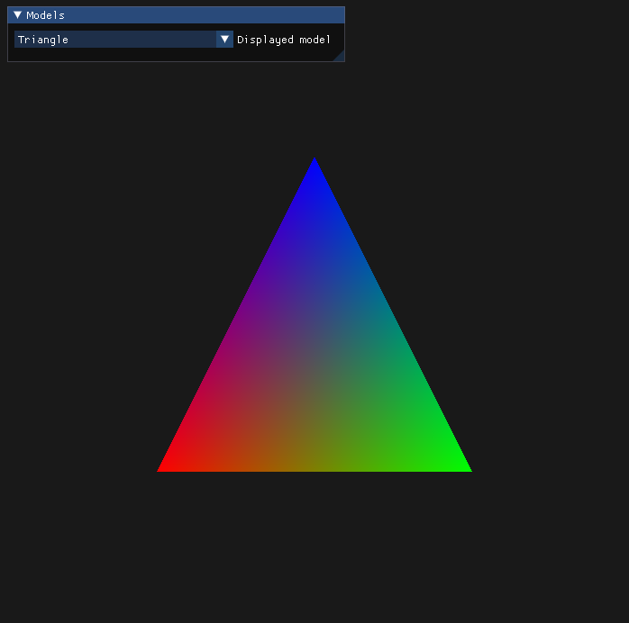
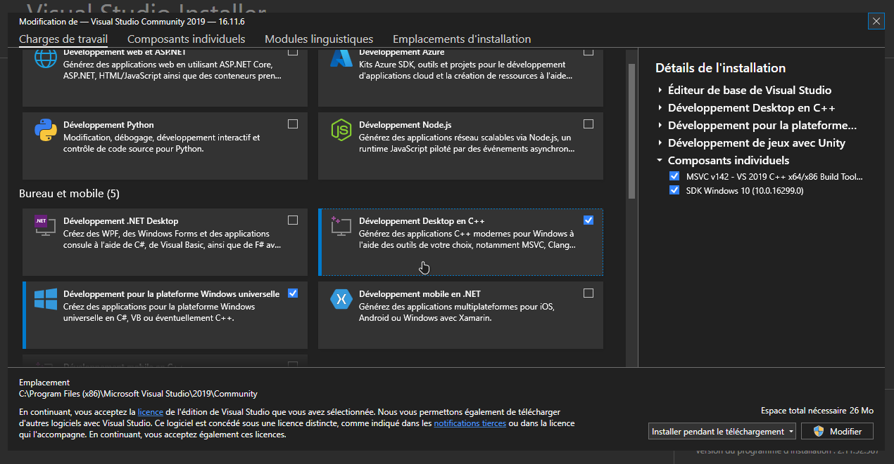

# Computer Graphics - Assignment No.4
## Hugo Boichard (7001879)

This project was done for an assignment in computer graphics. The program is very simple and allows to display different geometric shapes in a window with the OpenGL library. It also uses imgui for the UI and glfw3 to initialize the rendering window.

### Setup

This project was done with Visual Studio. You can open it and compile it with the file `CGAssignment4.sln` at the root of the project. Before doing so, make sure that Visual Studio and the `C++ Desktop Development` module are correctly installed on your computer.

If Visual Studio is not installed on your computer, you can download it [here](https://visualstudio.microsoft.com/fr/). When you install it, make sure to enable the `C++ Desktop Development` module.

